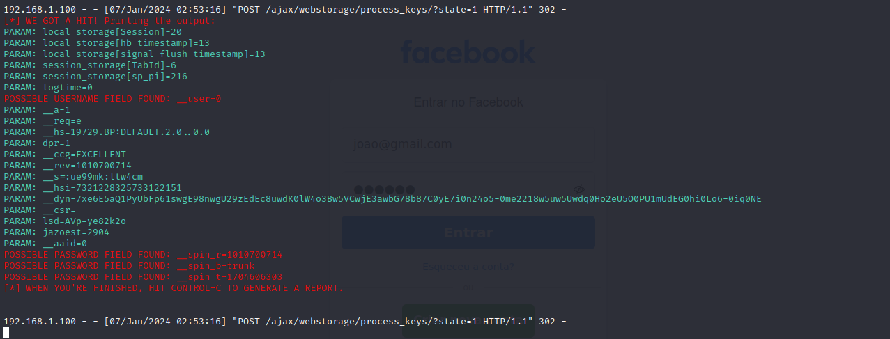

# Phishing para captura de senhas do Facebook 
# Desafio de projeto da DIO.me

### Ferramentas usadas

- Kali Linux
- setoolkit

### Configurando o Phishing no Kali Linux

1- Acesso root: ``` sudo su ```
2- Iniciando o setoolkit: ``` setoolkit ```
3- Tipo de ataque: ``` Social-Engineering Attacks ```
4- Vetor de ataque: ``` Web Site Attack Vectors ```
5- Método de ataque: ```Credential Harvester Attack Method ```
6- Método de ataque: ``` Site Cloner ```
7- Obtendo o endereço da máquina: ``` ifconfig ```
8- URL para clone: http://www.facebook.com

### Resutados



# Após inumeras tentativas não consegui capturar o usuário e senha, acredito que o setookit não esta funcionando, aguardo instruções
